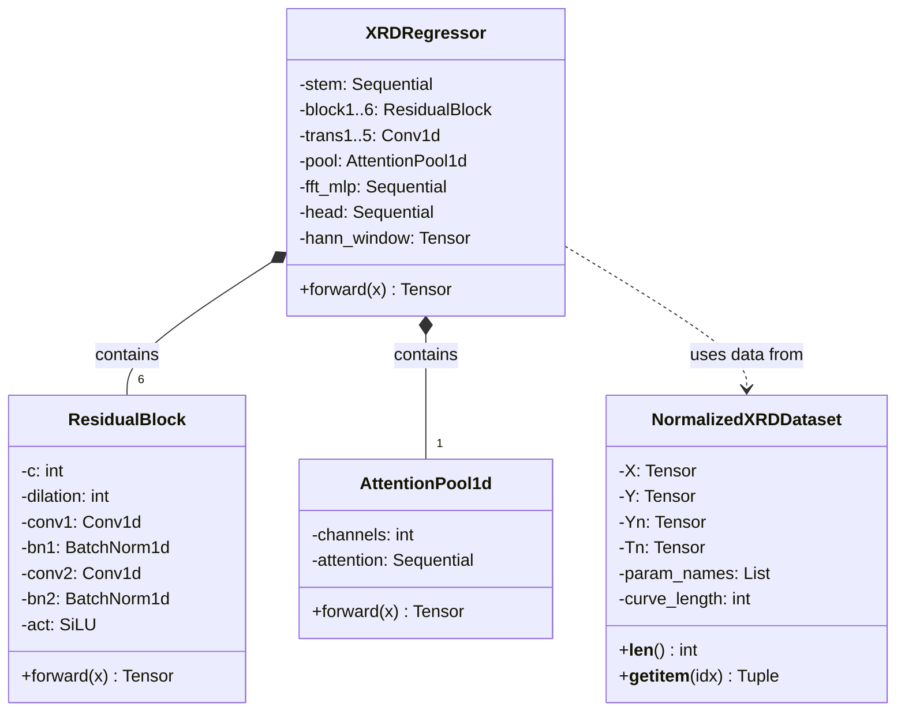

```mermaid
classDiagram
    class XRDRegressor {
        -stem: Sequential
        -block1..6: ResidualBlock
        -trans1..5: Conv1d
        -pool: AttentionPool1d
        -fft_mlp: Sequential
        -head: Sequential
        -hann_window: Tensor
        +forward(x) Tensor
    }

    class ResidualBlock {
        -c: int
        -dilation: int
        -conv1: Conv1d
        -bn1: BatchNorm1d
        -conv2: Conv1d
        -bn2: BatchNorm1d
        -act: SiLU
        +forward(x) Tensor
    }

    class AttentionPool1d {
        -channels: int
        -attention: Sequential
        +forward(x) Tensor
    }

    class NormalizedXRDDataset {
        -X: Tensor
        -Y: Tensor
        -Yn: Tensor
        -Tn: Tensor
        -param_names: List
        -curve_length: int
        +__len__() int
        +__getitem__(idx) Tuple
    }

    XRDRegressor *-- "6" ResidualBlock : contains
    XRDRegressor *-- "1" AttentionPool1d : contains
    XRDRegressor ..> NormalizedXRDDataset : uses data from

```
