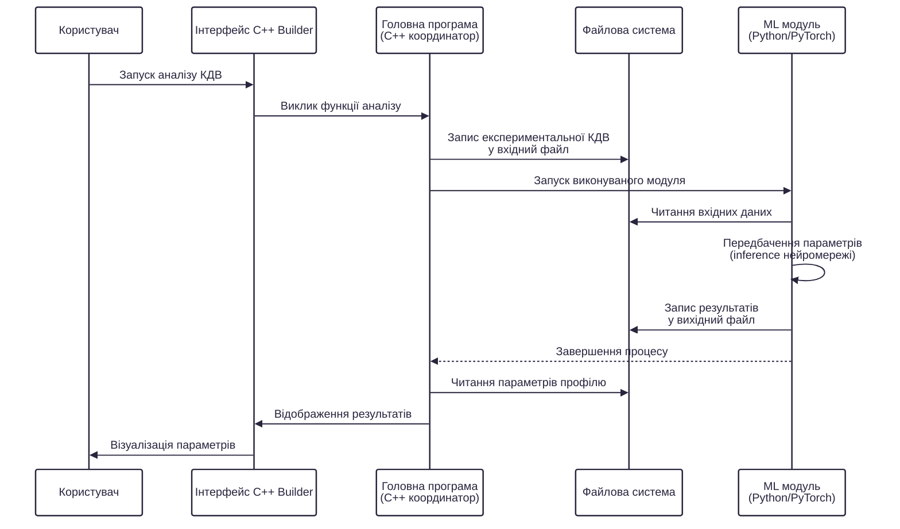

```mermaid
---
config:
  theme: redux
---
sequenceDiagram
    participant User as Користувач
    participant UI as Інтерфейс C++ Builder
    participant Main as Головна програма<br/>(C++ координатор)
    participant FS as Файлова система
    participant ML as ML модуль<br/>(Python/PyTorch)
    User->>UI: Запуск аналізу КДВ
    UI->>Main: Виклик функції аналізу
    Main->>FS: Запис експериментальної КДВ<br/>у вхідний файл
    Main->>ML: Запуск виконуваного модуля
    ML->>FS: Читання вхідних даних
    ML->>ML: Передбачення параметрів<br/>(inference нейромережі)
    ML->>FS: Запис результатів<br/>у вихідний файл
    ML-->>Main: Завершення процесу
    Main->>FS: Читання параметрів профілю
    Main->>UI: Відображення результатів
    UI->>User: Візуалізація параметрів
```
