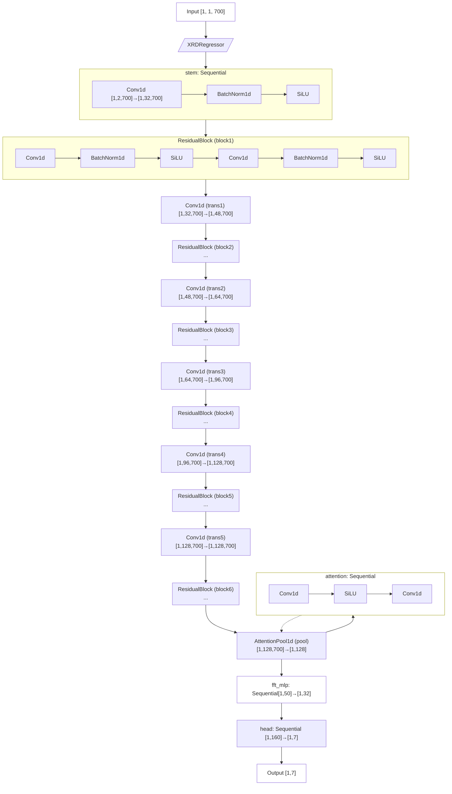

```mermaid
---
config:
  themeVariables:
    nodeSpacing: 10
    rankSpacing: 15
  layout: fixed
---
flowchart TB
 subgraph Stem["stem: Sequential"]
        stconv["Conv1d [1,2,700]→[1,32,700]"]
        stbn["BatchNorm1d"]
        stact["SiLU"]
  end
 subgraph Block1["ResidualBlock (block1)"]
        b1conv1["Conv1d"]
        b1bn1["BatchNorm1d"]
        b1act1["SiLU"]
        b1conv2["Conv1d"]
        b1bn2["BatchNorm1d"]
        b1act2["SiLU"]
  end
 subgraph Block2["ResidualBlock (block2) <br> ..."]
  end
 subgraph Block3["ResidualBlock (block3)<br> ..."]
  end
 subgraph Block4["ResidualBlock (block4)<br> ..."]
  end
 subgraph Block5["ResidualBlock (block5)<br> ..."]
  end
 subgraph Block6["ResidualBlock (block6)<br> ..."]
  end
 subgraph attention["attention: Sequential"]
        attconv1["Conv1d"]
        attact["SiLU"]
        attconv2["Conv1d"]
  end
    input["Input [1, 1, 700]"] --> reg[/"XRDRegressor"/]
    stconv --> stbn
    stbn --> stact
    b1conv1 --> b1bn1
    b1bn1 --> b1act1
    b1act1 --> b1conv2
    b1conv2 --> b1bn2
    b1bn2 --> b1act2
    attconv1 --> attact
    attact --> attconv2
    reg --> Stem
    Stem --> Block1
    Block1 --> t1["Conv1d (trans1) [1,32,700]→[1,48,700]"]
    t1 --> Block2
    Block2 --> t2["Conv1d (trans2)[1,48,700]→[1,64,700]"]
    t2 --> Block3
    Block3 --> t3["Conv1d (trans3)[1,64,700]→[1,96,700]"]
    t3 --> Block4
    Block4 --> t4["Conv1d (trans4)[1,96,700]→[1,128,700]"]
    t4 --> Block5
    Block5 --> t5["Conv1d (trans5)[1,128,700]→[1,128,700]"]
    t5 --> Block6
    Block6 --> pool["AttentionPool1d (pool)[1,128,700]→[1,128]"]
    pool --> attention & mlp["fft_mlp: Sequential[1,50]→[1,32]"]
    mlp --> head["head: Sequential [1,160]→[1,7]"]
    head --> output["Output [1,7]"]
    attention -. <br> .-> pool
    style input fill:transparent
    style attention fill:transparent
    style mlp fill:transparent
    style output fill:transparent
```
