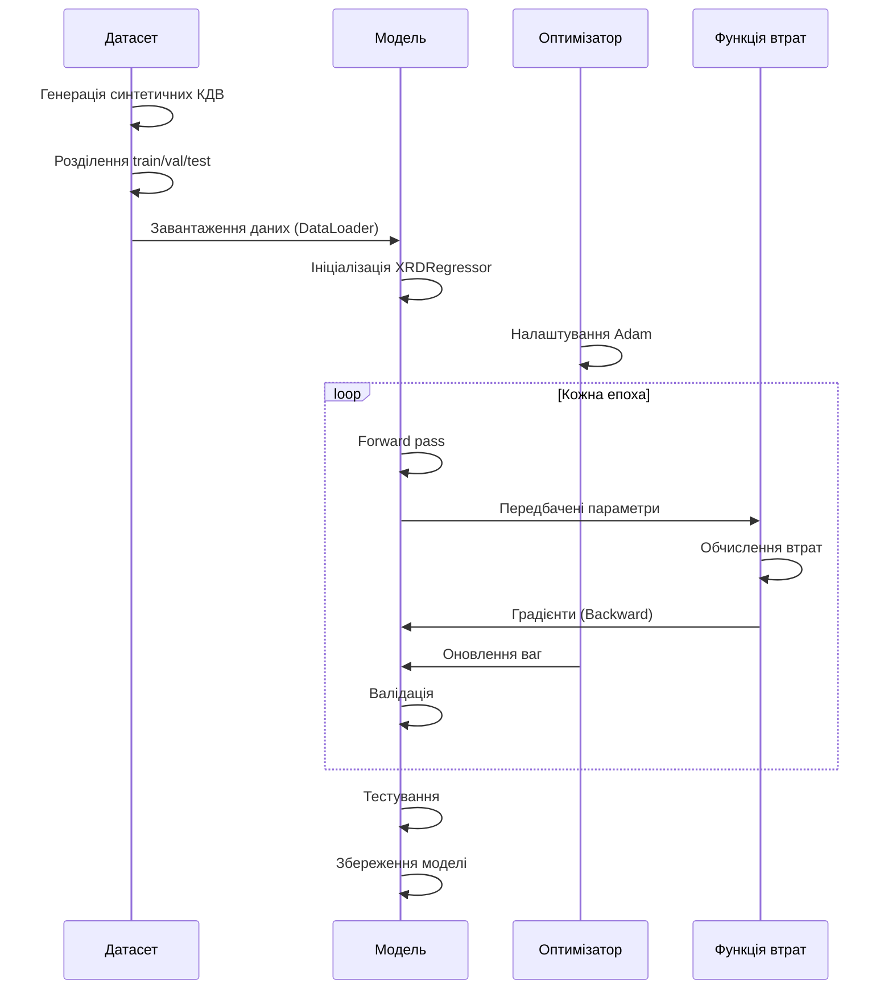

# Діаграма процесу навчання моделі

```mermaid
sequenceDiagram
    participant D as Датасет
    participant M as Модель
    participant O as Оптимізатор
    participant L as Функція втрат

    D->>D: Генерація синтетичних КДВ
    D->>D: Розділення train/val/test
    D->>M: Завантаження даних (DataLoader)
    M->>M: Ініціалізація XRDRegressor
    O->>O: Налаштування Adam

    loop Кожна епоха
        M->>M: Forward pass
        M->>L: Передбачені параметри
        L->>L: Обчислення втрат
        L->>M: Градієнти (Backward)
        O->>M: Оновлення ваг
        M->>M: Валідація
    end

    M->>M: Тестування
    M->>M: Збереження моделі
```
