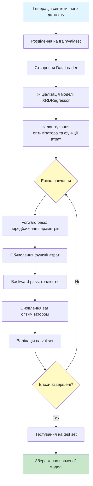

# Діаграма процесу навчання моделі

```mermaid
flowchart TD
    A[Генерація синтетичного датасету] --> B[Розділення на train/val/test]
    B --> C[Створення DataLoader]
    C --> D[Ініціалізація моделі XRDRegressor]
    D --> E[Налаштування оптимізатора та функції втрат]
    E --> F{Епоха навчання}
    F --> G[Forward pass: передбачення параметрів]
    G --> H[Обчислення функції втрат]
    H --> I[Backward pass: градієнти]
    I --> J[Оновлення ваг оптимізатором]
    J --> K[Валідація на val set]
    K --> L{Епохи завершені?}
    L -->|Ні| F
    L -->|Так| M[Тестування на test set]
    M --> N[Збереження навченої моделі]

    style A fill:#e1f5ff
    style N fill:#c8e6c9
    style F fill:#fff9c4
    style L fill:#fff9c4
```
